  

    

  

    

  <table width="100%" style="border: none;">
    <tr>
      <td width="50%" valign="top">
        
      </td>
      <td width="50%" valign="top">
        
      </td>
    </tr>
  </table>

   

  

    
    
    
    
    
  

